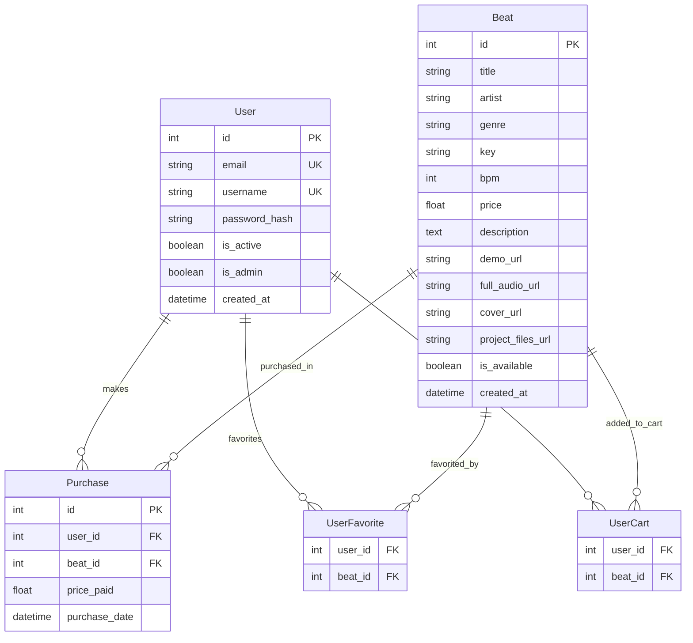

# Схема базы данных BeatStore

## ER-диаграмма



## Структура таблиц

### users
| Поле | Тип | Описание | Ограничения |
|------|-----|----------|-------------|
| id | INTEGER | Первичный ключ | PRIMARY KEY, AUTOINCREMENT |
| email | VARCHAR(255) | Email пользователя | UNIQUE, NOT NULL |
| username | VARCHAR(100) | Имя пользователя | UNIQUE, NOT NULL |
| password_hash | VARCHAR(255) | Хеш пароля | NOT NULL |
| is_active | BOOLEAN | Активен ли пользователь | DEFAULT TRUE |
| is_admin | BOOLEAN | Администратор | DEFAULT FALSE |
| created_at | DATETIME | Дата создания | DEFAULT CURRENT_TIMESTAMP |

### beats
| Поле | Тип | Описание | Ограничения |
|------|-----|----------|-------------|
| id | INTEGER | Первичный ключ | PRIMARY KEY, AUTOINCREMENT |
| title | VARCHAR(255) | Название бита | NOT NULL |
| artist | VARCHAR(255) | Исполнитель | NOT NULL |
| genre | VARCHAR(100) | Жанр | NOT NULL |
| key | VARCHAR(10) | Тональность | NULL |
| bpm | INTEGER | Темп (удары в минуту) | NOT NULL |
| price | DECIMAL(10,2) | Цена | DEFAULT 0.00 |
| description | TEXT | Описание | NULL |
| demo_url | VARCHAR(500) | URL демо-версии | NULL |
| full_audio_url | VARCHAR(500) | URL полной версии | NULL |
| cover_url | VARCHAR(500) | URL обложки | NULL |
| project_files_url | VARCHAR(500) | URL файлов проекта | NULL |
| is_available | BOOLEAN | Доступен для продажи | DEFAULT TRUE |
| created_at | DATETIME | Дата создания | DEFAULT CURRENT_TIMESTAMP |

### purchases
| Поле | Тип | Описание | Ограничения |
|------|-----|----------|-------------|
| id | INTEGER | Первичный ключ | PRIMARY KEY, AUTOINCREMENT |
| user_id | INTEGER | ID пользователя | FOREIGN KEY, NOT NULL |
| beat_id | INTEGER | ID бита | FOREIGN KEY, NOT NULL |
| price_paid | DECIMAL(10,2) | Оплаченная сумма | NOT NULL |
| purchase_date | DATETIME | Дата покупки | DEFAULT CURRENT_TIMESTAMP |

### user_favorites (связующая таблица)
| Поле | Тип | Описание | Ограничения |
|------|-----|----------|-------------|
| user_id | INTEGER | ID пользователя | FOREIGN KEY, NOT NULL |
| beat_id | INTEGER | ID бита | FOREIGN KEY, NOT NULL |
| PRIMARY KEY | (user_id, beat_id) | Составной ключ | |

### user_cart (связующая таблица)
| Поле | Тип | Описание | Ограничения |
|------|-----|----------|-------------|
| user_id | INTEGER | ID пользователя | FOREIGN KEY, NOT NULL |
| beat_id | INTEGER | ID бита | FOREIGN KEY, NOT NULL |
| PRIMARY KEY | (user_id, beat_id) | Составной ключ | |

## Связи между таблицами

### One-to-Many
- **User → Purchase**: Один пользователь может совершить множество покупок
- **Beat → Purchase**: Один бит может быть куплен множеством пользователей

### Many-to-Many
- **User ↔ Beat (favorites)**: Пользователь может добавить множество битов в избранное, бит может быть в избранном у множества пользователей
- **User ↔ Beat (cart)**: Пользователь может добавить множество битов в корзину, бит может быть в корзине у множества пользователей

## Индексы

```sql
-- Индексы для оптимизации запросов
CREATE INDEX idx_user_email ON users(email);
CREATE INDEX idx_user_username ON users(username);
CREATE INDEX idx_beat_genre ON beats(genre);
CREATE INDEX idx_beat_bpm ON beats(bpm);
CREATE INDEX idx_beat_price ON beats(price);
CREATE INDEX idx_beat_available ON beats(is_available);
CREATE INDEX idx_purchase_user ON purchases(user_id);
CREATE INDEX idx_purchase_beat ON purchases(beat_id);
CREATE INDEX idx_purchase_date ON purchases(purchase_date);
```

## Ограничения целостности

```sql
-- Внешние ключи
ALTER TABLE purchases ADD CONSTRAINT fk_purchase_user 
    FOREIGN KEY (user_id) REFERENCES users(id) ON DELETE CASCADE;

ALTER TABLE purchases ADD CONSTRAINT fk_purchase_beat 
    FOREIGN KEY (beat_id) REFERENCES beats(id) ON DELETE CASCADE;

ALTER TABLE user_favorites ADD CONSTRAINT fk_favorite_user 
    FOREIGN KEY (user_id) REFERENCES users(id) ON DELETE CASCADE;

ALTER TABLE user_favorites ADD CONSTRAINT fk_favorite_beat 
    FOREIGN KEY (beat_id) REFERENCES beats(id) ON DELETE CASCADE;

ALTER TABLE user_cart ADD CONSTRAINT fk_cart_user 
    FOREIGN KEY (user_id) REFERENCES users(id) ON DELETE CASCADE;

ALTER TABLE user_cart ADD CONSTRAINT fk_cart_beat 
    FOREIGN KEY (beat_id) REFERENCES beats(id) ON DELETE CASCADE;

-- Проверочные ограничения
ALTER TABLE beats ADD CONSTRAINT chk_beat_price 
    CHECK (price >= 0);

ALTER TABLE beats ADD CONSTRAINT chk_beat_bpm 
    CHECK (bpm > 0 AND bpm <= 300);

ALTER TABLE purchases ADD CONSTRAINT chk_purchase_price 
    CHECK (price_paid >= 0);
```
