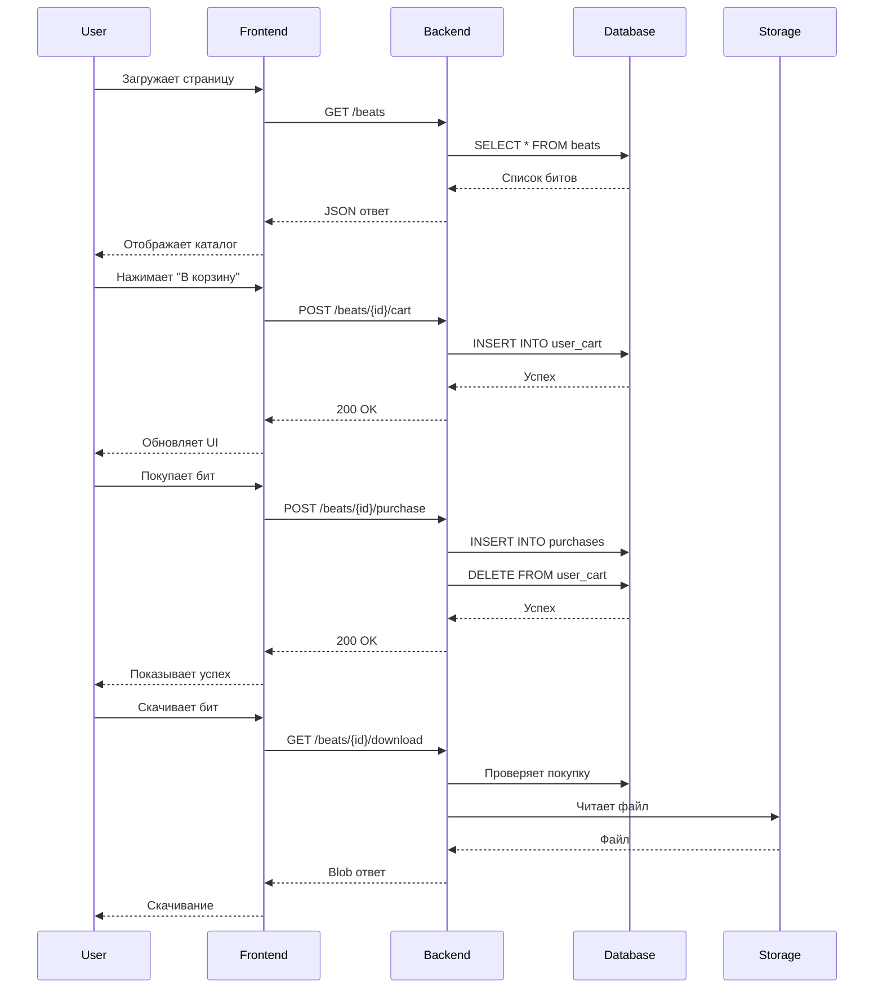
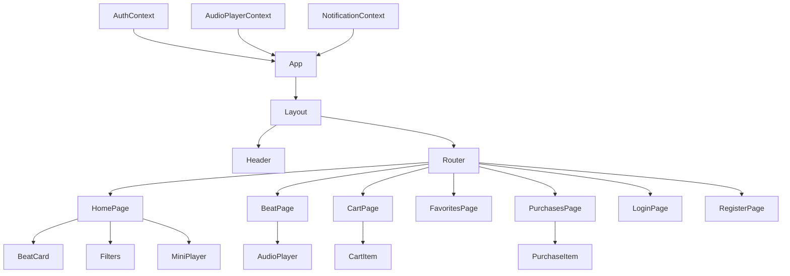
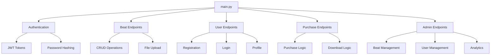

# Архитектура системы BeatStore

## Общая схема системы

```mermaid
graph TB
    subgraph "Frontend (React)"
        A[HomePage] --> B[BeatCard]
        A --> C[Filters]
        A --> D[MiniPlayer]
        E[BeatPage] --> F[AudioPlayer]
        G[CartPage] --> H[CartItem]
        I[FavoritesPage] --> B
        J[PurchasesPage] --> K[PurchaseItem]
        L[Header] --> M[Navigation]
    end
    
    subgraph "Backend (FastAPI)"
        N[API Endpoints] --> O[Authentication]
        N --> P[Beat Management]
        N --> Q[User Management]
        N --> R[Purchase System]
    end
    
    subgraph "Database (SQLite)"
        S[Users Table]
        T[Beats Table]
        U[Purchases Table]
        V[Favorites Table]
        W[Cart Table]
    end
    
    subgraph "File Storage"
        X[Audio Files]
        Y[Cover Images]
        Z[Project Files]
    end
    
    A --> N
    E --> N
    G --> N
    I --> N
    J --> N
    
    N --> S
    N --> T
    N --> U
    N --> V
    N --> W
    
    N --> X
    N --> Y
    N --> Z
```

## Поток данных

## Компонентная архитектура

### Frontend компоненты

### Backend структура

## API Endpoints

### Публичные endpoints
- `GET /beats` - Получить список битов
- `GET /beats/{id}` - Получить информацию о бите
- `POST /register` - Регистрация пользователя
- `POST /login` - Вход в систему

### Аутентифицированные endpoints
- `GET /me` - Информация о текущем пользователе
- `GET /favorites` - Избранные биты
- `POST /beats/{id}/favorite` - Добавить в избранное
- `DELETE /beats/{id}/favorite` - Удалить из избранного
- `GET /cart` - Корзина
- `POST /beats/{id}/cart` - Добавить в корзину
- `DELETE /beats/{id}/cart` - Удалить из корзины
- `GET /purchases` - Покупки пользователя
- `POST /beats/{id}/purchase` - Купить бит
- `GET /beats/{id}/download` - Скачать бит

### Административные endpoints
- `POST /api/admin/login` - Вход администратора
- `GET /api/admin/beats` - Управление битами
- `POST /api/admin/upload-beat` - Загрузка нового бита
- `PUT /api/admin/beats/{id}` - Обновление бита
- `DELETE /api/admin/beats/{id}` - Удаление бита
- `GET /api/admin/purchases` - Просмотр покупок
- `GET /api/admin/analytics` - Аналитика

## Безопасность

### Аутентификация
- JWT токены с истечением срока действия
- Refresh токены для продления сессии
- Хеширование паролей с bcrypt

### Авторизация
- Роли пользователей (user/admin)
- Проверка прав доступа на уровне API
- Защита от CSRF атак

### Валидация данных
- Pydantic модели для валидации
- Санитизация пользовательского ввода
- Защита от SQL инъекций через ORM

## Производительность

### Frontend оптимизации
- Lazy loading компонентов
- Мемоизация дорогих вычислений
- Виртуализация списков
- Кэширование API запросов

### Backend оптимизации
- Индексы в базе данных
- Пагинация результатов
- Кэширование статических файлов
- Асинхронная обработка запросов

### База данных
- Оптимизированные запросы
- Индексы на часто используемых полях
- Связи через внешние ключи
- Транзакции для целостности данных

## Масштабируемость

### Горизонтальное масштабирование
- Stateless архитектура
- Микросервисная готовность
- Контейнеризация с Docker
- Load balancing готовность

### Вертикальное масштабирование
- Оптимизация запросов к БД
- Кэширование на разных уровнях
- CDN для статических файлов
- Мониторинг производительности
